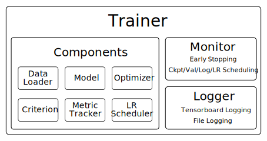

# Scientific PyTorch Template

1. [Introduction](#introduction)
2. [Implementation Details](#implementation-details)
   1. [Controller](#controller)
   2. [Trainer](#trainer)
      1. [Components](#components)
      2. [Logger](#logger)
      3. [Monitor](#monitor)
3. [Create a new Project](#create-a-new-project)

## Introduction

In this repository we present a PyTorch template to facilitate scientific research using deep learning. The framework is designed to hide most of the boilerplate code and expose only intuitive interfaces that allow the user to tailor the pipeline to their specific needs. We focus on simplifying the scheduling of several experiments and create result directories that ensure full reproducibility. Furthermore, we put an emphasis on informative status updates and support both, epoch-based and iteration-based training. In the following, we describe the individual components of the template and provide information on how to create a new project.

## Implementation Details

At the highest level of abstraction, the template is based on the concepts of _Sessions_ and _Experiments_. A session is associated with a single config file that specifies all relevant parameters for training and evaluation. The session-level config file can contain parameter values for an arbitary number of experiments. If parameters for multiple experiments are provided, all combinations are extracted automatically and parsed into experiment-level configs which are then used to create individual experiments. This setup allows us to formulate hyper-parameter searches as a single session with several experiments. An illustration of the framework is displayed in the figure below. In the following sections we provide a more detailed explanation of the pipeline's main components.

<p align="center">
  
</p>

### Controller

The controller object operates at the highest level of the framework and controls the execution of individual experiments within a session. Its main task consists of analyzing the session-level config file and extracting all parameter combinations, parsing them into experiment-level config files. In order to be able to intuitively define several experiments from a single config file, we rely on a simple syntax, which we describe below. Given a set of experiment-level configs, the controller merely instantiates an iterator over all experiments, leaving the execution of the training process to the respective trainer object.

#### Session-level Config

In order to be able to create several experiments using a single config file, we rely on a simple mechanism. Every parameter
for which several values should be tested, is to be provided in the form of a list containing all values. Since there might exist other parameters for which a list is required to specify a single experiment, e.g. a list of loss weights, we choose to add a trailing underscore to indicate parameter values for several experiments. For example, the following config file would create six experiments for all possible combinations of batch size and learning rate, using the same loss weights for all experiments.

```
learning_rate_: [0.001, 0.01, 0.1]
batch_size_: [8, 16]
loss_weights: [1.0, 10.0, 0.001]
```

For now, the template only supports grid searches. However, the concept can be extended to other methods such as random search or bayesian optimization by slightly adjusting the session-level config syntax.

### Trainer

The trainer object operates at the experiment-level and has no knowledge of other experiments being scheduled within the same session. It is instantiated by the controller, passing only the config file for the respective experiment and the path to the result directory. The trainer handles the training and evaluation for one fixed set of parameters and is further responsible for the visualization and saving of the experimental results. In the figure below we provide an illustration of the trainer's modules and explain their functionality in the following sections.

<p align="center">
  
</p>

#### Components

The so-called components comprise all project-specific objects required for training and evaluation. This includes the dataset and the model as well as optimizer, loss function and learning rate scheduler. For all of these components, standard PyTorch modules can be used. The metric tracker object provides functionality to accumulate network outputs and transform them into relevant metrics for e.g. visualization and logging purposes as well as model evaluation.
To allow the user to fully rely on the main config file to specify relevant parameters, each component is created in an individual ```build_component_x``` function which is called from the trainer's constructor. This function is given the experiment-level config file as the only argument, providing a clean interface for modifying each component separately. 

#### Logger

Unlike the previously described components, the logger object is expected to be project-independent to a large extent. It offers functions to log and visualize the entire training process and is designed to be modified by using config flags only. By setting the ```write_file``` and ```write_tb``` flags, logging of the entire console output to a text file as well as tensorboard logging can be enable and disabled individually. We provide a wrapper around the standard tensorboard writer that allows to visualize training and validation performance without having to use separate writer object. We simply switch between the different writers by setting a ```train``` or ```val``` mode, similar to PyTorch's model conventions. 

#### Monitor

Naturally, a training process comprises a large number of different computations to be performed according to different scheduling parameters. In order to group all code related to the scheduling of certain tasks such as validation, logging, checkpoint saving or parameter updates, we propose the monitor object. Similar to the logger object, the monitor is not required to be modified for different projects. The monitor setup can be handled by providing frequencies at which a certain task is to be executed in the respective config file. 
Another motivation for the monitor class is to provide a unified treatment of both, epoch-based and iteration-based training. We achieve intuitive switching between the two training paradigms by internally converting all specified frequencies to iterations and only converting user outputs back to epochs if specified by the user. The training paradigm can be set in the config file by specifiying the training duration. If ```num_iterations``` is specified in the config file, iteration-based training is performed and all other frequencies are expected to be provided in iterations as well. Epoch-based training, on the other hand, is performed if ```num_epochs```is provided. Then, all other frequencies are expected to be specified in epochs as well. The only exception to this is the logging frequency which is always specified in iterations due to the comparably high frequency of the logging procedure.

## Create a new Project

In order to create a new project using the template structure, we provide a script to copy all relevant files to a desired project location. Simply call ```python copy_template.py /path/to/new/project``` from the command line to create your new project structure. A basic stand-alone example is provided which allows you to just run ```train.py --cfg /path/to/config --session "session_name"``` and get an idea of what the output of the framework looks like. In order to start modifying the template, we recommend you to start in ```utilities/build_components.py```. Specify the components you need for your project, check for consistency of tensor shapes and data structures in ```trainers/trainer.py``` and start training!

## Questions and Feedback 

The main motivation behind this PyTorch template was for us to create a pipeline from scratch that is tailored towards our specific needs as graduate students doing research in deep learning. Furthermore, we strongly feel that only with a pipleine we created ourselves, we're be able to fully focus on designing new components and comparing results accross a large number of experiments. Of course, our pipeline is somewhat inspired by several other templates available online, but only if specifically indicated in the code, did we use code from other repositories. If you end up using this template for one of your projects, we'd appreciate if you shared your thoughts about the design choices we made and helped us further improve the framework. Also, if you run into problems or have difficulties understanding the funtionality of certain components, don't hesitate to contact us.
