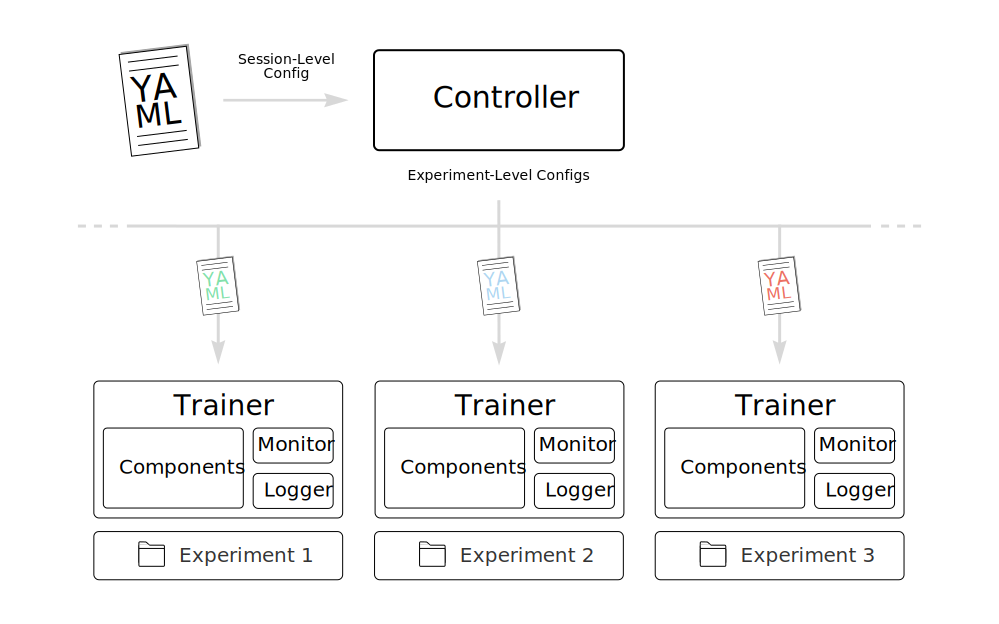

# Scientific Pytorch Template

1. [Introduction](#introduction)
2. [Implementation Details](#implementation-details)
   1. [Controller](#controller)
   2. [Trainer](#trainer)
      1. [Components](#components)
      2. [Logger](#logger)
      3. [Monitor](#monitor)
3. [Create a new Project](#create-a-new-project)

## Introduction

In this repository we present a PyTorch template to facilitate scientific research using deep learning. The framework is designed to hide most of the standard boilerplate code and expose only intuitive interfaces that allow the user to tailor the pipeline to their specific needs. We specifically focus on simplifying the scheduling of several experiments while saving results in a way that ensures full reproducibility.

## Implementation Details

At the highest level of abstraction, the template is based on the concepts of _Sessions_ and _Experiments_. Each session is associated with a config file that specifies all relevant parameters for one or more experiments. 

  

### Controller

### Trainer

#### Components

#### Logger

#### Monitor

## Create a new Project
